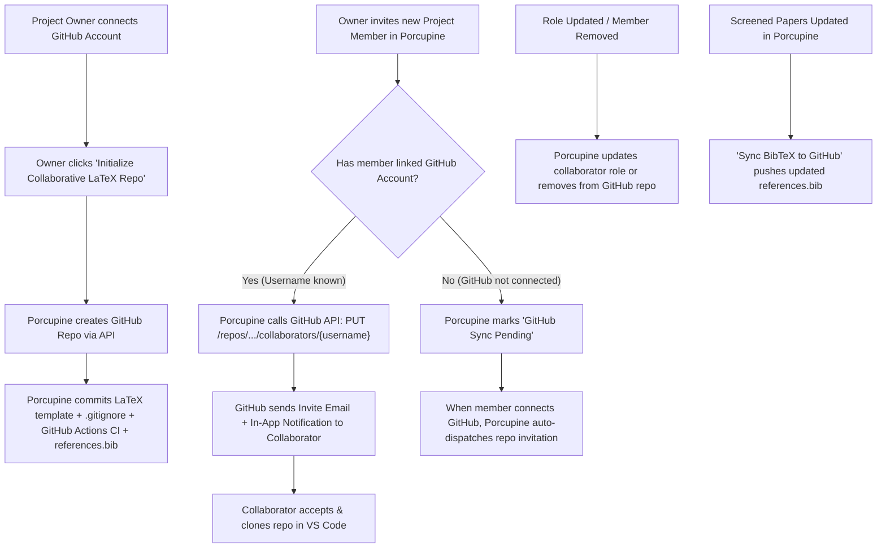

# Local LaTeX + VS Code + Git/GitHub Collaboration Guide & GitHub Automation Feasibility Plan

## Executive Summary

This plan addresses two major requirements:
1. **Homepage Comprehensive Guide**: Creating a comprehensive, step-by-step interactive guide on the homepage on how to set up a local LaTeX project, edit it using VS Code with the official [LaTeX Workshop extension (`James-Yu.latex-workshop`)](https://marketplace.visualstudio.com/items?itemName=James-Yu.latex-workshop), and collaborate seamlessly using Git & GitHub.
2. **GitHub Connection & Automated Collaborator Sync Analysis**: A rigorous technical evaluation of whether and how Porcupine can provide an automated GitHub integration (creating repos and automatically syncing project members as repository collaborators like Google Drive/Docs), analyzing feasibility, critical shortcomings, achievable scope, and better alternative paradigms.

---

## 1. Feasibility Analysis: Automated GitHub Connection vs. Google Drive Workflow

> [!IMPORTANT]
> **Can GitHub be automated to create a repo and sync collaborators when adding members to a project?**
> **Verdict: YES, it is technically possible**, but with **fundamental operational and structural differences** compared to Google Drive.

### A. Comparison: Google Drive vs. GitHub Integration Mechanics

| Architectural Dimension | Google Drive Integration (Current) | GitHub Repository Integration |
| :--- | :--- | :--- |
| **User Identity** | Direct Email (`user@gmail.com`). Anyone with an email can be invited without prior setup. | **GitHub Username** (e.g. `@octocat`). GitHub's API requires knowing the user's GitHub username to invite them to a personal/org repository. |
| **Permission Granting** | **Direct / Silent**: Permissions are immediately assigned to the email; folder appears in Drive. | **Explicit Acceptance Required**: GitHub API (`PUT /repos/{owner}/{repo}/collaborators/{username}`) generates a **Repository Invitation**. The invitee **must click "Accept Invitation"** via email or GitHub UI before they can clone/push. |
| **Editing & State Paradigm** | **Live Real-time Collaboration (OT)**. Multi-cursor simultaneous editing with automatic conflict-free convergence in Google Docs. | **Asynchronous Distributed Version Control**. Commits are discrete. If two people push simultaneous edits to the same lines, `git push` is **rejected with merge conflicts**. |
| **Authentication Scope** | Google OAuth (`drive.file` / Drive API with offline refresh token). | GitHub OAuth with `repo` scope OR a dedicated **GitHub App** with fine-grained repository permissions (`contents: write`, `administration: write`). |
| **Auxiliary Build Artifacts** | Docs/Sheets are hosted natively in the cloud. | LaTeX compilation produces 10+ auxiliary intermediate files (`.aux`, `.bbl`, `.fls`, `.synctex.gz`, `.log`). If unignored, they cause severe merge collisions. |

---

### B. What CAN Be Achieved (The Feasible Automated GitHub Workflow)

Porcupine can implement a streamlined, robust GitHub workflow:



1. **Automated Repository Provisioning**:
   - Project Owner connects their GitHub account.
   - 1-click generation of a new repository (e.g., `porcupine-latex-review-[slug]`).
   - Porcupine auto-commits:
     - Curated academic multi-file LaTeX starter template.
     - Production-ready `.gitignore` (ignoring auxiliary build artifacts).
     - Live-synced `references.bib` containing screened papers from the project.
     - `.github/workflows/compile.yml` GitHub Action to automatically compile the PDF on every push.
2. **Automated Collaborator Synchronization**:
   - When a member is invited in Porcupine (`inviteMember` action):
     - If the member has a linked GitHub account: Porcupine automatically invites their GitHub username with the corresponding permission (`push` for `OWNER`/`ADMIN`/`CONTRIBUTOR`, `triage`/`pull` for `REVIEWER`/`OBSERVER`).
     - If the member has not linked GitHub: Porcupine displays a "Connect GitHub to join the LaTeX repository" badge, and dispatches the invite the moment they link their account.
   - When a member's role is updated or they are removed: Porcupine adjusts collaborator permissions or calls `DELETE /repos/{owner}/{repo}/collaborators/{username}`.
3. **Automated BibTeX Sync**:
   - A single click in Porcupine: "Push Latest References to GitHub", automatically committing the updated `references.bib` to the repository.

---

### C. Shortcomings & Critical Risks to Address

> [!WARNING]
> 1. **Invitation Acceptance Barrier**: Unlike Google Drive where files appear instantly, GitHub *mandates* explicit invitation acceptance for security and spam prevention. Users must accept before they can push.
> 2. **Git is NOT a Live Collaborative Canvas**: Git does not support simultaneous real-time keystroke typing out-of-the-box. If two authors edit the same sentence simultaneously and push, the second author will face a merge conflict.
> 3. **LaTeX Auxiliary File Collisions**: If team members accidentally commit `.aux`, `.bbl`, `.synctex.gz`, or `.pdf` files, Git history will constantly conflict. A strict `.gitignore` is mandatory.
> 4. **OAuth Token Privileges**: Requesting broad `repo` OAuth scope gives access to *all* user repositories. A **GitHub App** with repository-level installation is the more defensible, secure pattern.

---

### D. Better Alternatives & Value-Add Enhancements

To make this workflow effortless for research teams:

1. **True Real-time Live Collaboration in VS Code via Live Share (`ms-vsliveshare.vsliveshare`)**:
   - *The Problem*: Researchers want the "Google Docs / Overleaf" feel of simultaneous live cursors without Git conflicts.
   - *The Solution*: Pair **VS Code Live Share** with **LaTeX Workshop**. Authors can start a Live Share session directly in VS Code, co-write in real time on one author's machine with live cursors and shared build previews, and make clean, single Git commits when done!
2. **Semantic Line Breaks ("One Sentence Per Line") Rule**:
   - In LaTeX, a single newline does not create a new paragraph. By placing **each sentence on its own line**, Git treats sentence edits as isolated line diffs, **eliminating 95% of merge conflicts** between co-authors!
3. **Automated Cloud PDF Compilation via GitHub Actions CI/CD**:
   - Using `xu-cheng/latex-action` in `.github/workflows/compile.yml`, GitHub builds the PDF on every commit and publishes it as a downloadable release/artifact. Supervisors and non-technical reviewers can read the latest compiled PDF without ever installing LaTeX or TeX Live on their computer!

---

## 2. Homepage Comprehensive Guide: "Local LaTeX + VS Code + Git/GitHub Collaboration"

We will design and implement a rich, interactive, beautifully styled guide component directly on the Homepage (`/`), with clear tabs, platform selectors, copyable code blocks, and visual diagrams.

### Guide Structure & Detailed Contents:

```
┌────────────────────────────────────────────────────────────────────────────────────────┐
│  COLLABORATIVE RESEARCH WRITING                                                        │
│  The Definitive Local LaTeX + VS Code + Git & GitHub Collaboration Guide              │
│  [ Step 1: TeX Engine ] [ Step 2: VS Code & Extension ] [ Step 3: Project Structure ] │
│  [ Step 4: Git & GitHub ] [ Step 5: Team Workflow Rules ] [ Step 6: Automated CI PDF ]│
└────────────────────────────────────────────────────────────────────────────────────────┘
```

#### Step 1: Installing the Local TeX Engine / Distribution
- **macOS**: MacTeX (Full) or BasicTeX (`brew install --cask mactex-no-gui` or BasicTeX via Homebrew).
- **Windows**: MiKTeX (auto package installer) or TeX Live for Windows.
- **Linux (Ubuntu/Debian)**: `sudo apt update && sudo apt install texlive-full latexmk` (or `texlive-latex-extra`).
- **Verification Command**: Running `latexmk -v` and `pdflatex -v` in terminal to ensure the compiler is in `$PATH`. Note on Perl requirement for `latexmk`.

#### Step 2: Setting up VS Code & the LaTeX Workshop Extension
- Installing VS Code.
- Installing the official extension: **LaTeX Workshop** by James Yu:
  - **Marketplace Identifier**: `James-Yu.latex-workshop`
  - **Marketplace URL**: [https://marketplace.visualstudio.com/items?itemName=James-Yu.latex-workshop](https://marketplace.visualstudio.com/items?itemName=James-Yu.latex-workshop)
- **Essential VS Code `settings.json` snippet**:
  ```json
  {
    "latex-workshop.latex.autoBuild.run": "onSave",
    "latex-workshop.view.pdf.viewer": "tab",
    "latex-workshop.latex.tools": [
      {
        "name": "latexmk",
        "command": "latexmk",
        "args": [
          "-synctex=1",
          "-interaction=nonstopmode",
          "-file-line-error",
          "-pdf",
          "-outdir=%OUTDIR%",
          "%DOC%"
        ]
      }
    ],
    "latex-workshop.latex.recipes": [
      {
        "name": "latexmk",
        "tools": ["latexmk"]
      }
    ],
    "latex-workshop.synctex.afterBuild.enabled": true
  }
  ```
- **SyncTeX Magic**: `Cmd+Click` (macOS) / `Ctrl+Click` (Windows/Linux) in the TeX source jumps directly to the matching line in the PDF preview, and clicking in the PDF jumps straight back to the source code!

#### Step 3: Initializing the Multi-File Repository Scaffold
- Standard academic directory layout:
  ```
  my-research-paper/
  ├── main.tex                  # Root document (preamble, packages, inputs)
  ├── references.bib            # Bibliography (exported from Porcupine)
  ├── sections/                 # Modular chapters/sections
  │   ├── 01_introduction.tex
  │   ├── 02_related_work.tex
  │   ├── 03_methodology.tex
  │   ├── 04_results.tex
  │   └── 05_discussion.tex
  ├── figures/                  # Plots, diagrams, images (.pdf, .png)
  ├── .gitignore                # Crucial LaTeX ignore rules
  ├── .github/workflows/        # Automated cloud compilation
  │   └── compile.yml
  └── README.md
  ```
- **The Golden `.gitignore` for LaTeX**:
  ```gitignore
  # LaTeX auxiliary and intermediate build files
  *.aux
  *.bbl
  *.bcf
  *.blg
  *.fdb_latexmk
  *.fls
  *.idx
  *.ilg
  *.ind
  *.log
  *.nav
  *.out
  *.run.xml
  *.snm
  *.synctex.gz
  *.toc
  *.vrb
  
  # Optional: ignore generated PDF if building via CI, or track if releasing
  # main.pdf
  ```
- **Minimal Starter `main.tex` template**:
  ```latex
  \documentclass[11pt,a4paper]{article}
  \usepackage[utf8]{inputenc}
  \usepackage{amsmath,amsfonts,amssymb}
  \usepackage{graphicx}
  \usepackage{cite}
  \usepackage{hyperref}

  \title{Title of the Systematic Review or Research Paper}
  \author{Author One \and Author Two}
  \date{\today}

  \begin{document}
  \maketitle

  \begin{abstract}
  Brief summary of the research questions, methodology, and findings.
  \end{abstract}

  \input{sections/01_introduction}
  \input{sections/02_related_work}
  \input{sections/03_methodology}
  \input{sections/04_results}
  \input{sections/05_discussion}

  \bibliographystyle{plain}
  \bibliography{references}

  \end{document}
  ```

#### Step 4: Setting up Git & GitHub (CLI & GUI)
- **Command Line Setup**:
  ```bash
  cd my-research-paper
  git init
  git add .
  git commit -m "Initial commit: LaTeX paper scaffold"
  git branch -M main
  git remote add origin https://github.com/your-username/my-research-paper.git
  git push -u origin main
  ```
- **Adding Co-Authors on GitHub**:
  - Repo Settings → **Collaborators** → **Add people** → Enter co-author's GitHub username or email → Co-author receives email and clicks **Accept**.
  - Co-author clones in VS Code: `git clone https://github.com/your-username/my-research-paper.git` → Opens folder in VS Code.

#### Step 5: Collaborative Workflow & The "Zero-Conflict" Golden Rules
1. **Rule 1: Semantic Line Breaks (One Sentence Per Line)**: Never write entire paragraphs as one giant continuous line. Put every sentence on a new line. Git can now merge independent sentence edits with zero conflict.
2. **Rule 2: Modular Multi-File Ownership**: Split sections into `sections/*.tex`. Author A works in `03_methodology.tex` while Author B works in `04_results.tex`.
3. **Rule 3: Always Pull Before Writing**: `git pull --rebase origin main` before starting a writing session.
4. **Rule 4: Feature Branches & Pull Requests for Review**:
   - `git checkout -b edit-methods`
   - Commit & push: `git push -u origin edit-methods`
   - Open Pull Request on GitHub where supervisor/peers can comment on specific lines.
5. **Rule 5: Resolving Conflicts in VS Code**: Using the built-in 3-Way Merge Editor ("Accept Current", "Accept Incoming", or "Accept Both").

#### Step 6: Syncing Porcupine Bibliography (`references.bib`)
- In Porcupine: Navigate to project evidence/library → Export BibTeX → Save as `references.bib` in the project root.
- Citing in text: `\cite{author2026title}` with instant autocomplete supported by LaTeX Workshop!

#### Step 7: Automated Cloud PDF Compilation via GitHub Actions (CI/CD)
- Create `.github/workflows/compile.yml`:
  ```yaml
  name: Build LaTeX PDF
  on: [push, pull_request]

  jobs:
    build_pdf:
      runs-on: ubuntu-latest
      steps:
        - name: Check out repository
          uses: actions/checkout@v4

        - name: Compile LaTeX document
          uses: xu-cheng/latex-action@v3
          with:
            root_file: main.tex

        - name: Upload PDF Artifact
          uses: actions/upload-artifact@v4
          with:
            name: compiled-paper-pdf
            path: main.pdf
  ```
- Co-authors without local TeX installations can download the freshly compiled PDF directly from the GitHub Actions tab or Releases!

#### Step 8: Live Real-Time Co-Editing with VS Code Live Share
- Install **Live Share** (`ms-vsliveshare.vsliveshare`).
- Click "Share" in the status bar → Send the link to your co-author.
- Both authors edit the `.tex` files with live cursors simultaneously; the host's LaTeX Workshop recompiles the PDF live on save.

---

## 3. Proposed Changes to the Codebase

Grouped logically by component:

### Component: Homepage & Public Guides UI

#### [NEW] [latex-guide-section.tsx](file:///Users/dhrubojyoti/Projects/porcupine-the-smart-research-manager/apps/web/src/components/latex-guide-section.tsx)
A dedicated, high-aesthetic client component with:
- Step-by-step interactive tabs (1. Engine -> 2. VS Code & Extension -> 3. Structure -> 4. Git & GitHub -> 5. Rules -> 6. CI/CD & Live Share).
- OS selector for Mac / Windows / Linux commands.
- Interactive code copy buttons.
- Direct links to the [LaTeX Workshop Marketplace](https://marketplace.visualstudio.com/items?itemName=James-Yu.latex-workshop).
- Visual callouts for "The Golden Rule: One Sentence Per Line" and "SyncTeX Shortcuts".

#### [MODIFY] [page.tsx](file:///Users/dhrubojyoti/Projects/porcupine-the-smart-research-manager/apps/web/src/app/(public)/page.tsx)
- Embed the `LatexGuideSection` with high visual polish right on the landing page, positioned strategically to showcase Porcupine's end-to-end research workflow from systematic review extraction to collaborative paper writing.

#### [MODIFY] [guides/page.tsx](file:///Users/dhrubojyoti/Projects/porcupine-the-smart-research-manager/apps/web/src/app/(public)/guides/page.tsx)
- Add a dedicated section "Collaborative LaTeX Writing with VS Code & GitHub" referencing the complete guide and best practices.

---

### Component: Project GitHub Integration Architecture (Design & Roadmap)

#### [MODIFY] [schema.prisma](file:///Users/dhrubojyoti/Projects/porcupine-the-smart-research-manager/packages/db/prisma/schema.prisma) & [01-data-model.md](file:///Users/dhrubojyoti/Projects/porcupine-the-smart-research-manager/docs/01-data-model.md)
Document the data model extensions for GitHub repo linking:
- `Project`:
  - `githubRepoOwner String? @map("github_repo_owner")`
  - `githubRepoName String? @map("github_repo_name")`
  - `githubInstallationId String? @map("github_installation_id")`
  - `githubToken String? @map("github_token")`
- `User`:
  - `githubUsername String? @map("github_username")`
- `ProjectMember`:
  - `githubSyncStatus String? @map("github_sync_status") // "SYNCED" | "PENDING_INVITE" | "NOT_LINKED"`

#### [NEW] Future Architecture Plan for [docs/08-github-latex-integration.md](file:///Users/dhrubojyoti/Projects/porcupine-the-smart-research-manager/docs/08-github-latex-integration.md)
- Complete technical spec outlining the GitHub App webhook, OAuth token management, `PUT /repos/{owner}/{repo}/collaborators/{username}` dispatchers, and BibTeX sync background workers.

---

## 4. Verification Plan

### Automated Verification:
- Run Next.js TypeScript check and bundle build:
  ```bash
  pnpm --filter @Porcupine/web build
  ```
- Run linter and formatting checks:
  ```bash
  pnpm lint
  ```
- Run unit tests:
  ```bash
  pnpm test
  ```

### Manual & Visual Verification:
- Run dev server on `http://localhost:3000`.
- Verify the homepage (`/`) rendering across viewports (Desktop, Tablet, Mobile) using the browser subagent.
- Verify that tab switching, OS selector, copy-to-clipboard buttons, and marketplace links (`James-Yu.latex-workshop`) function smoothly with no hydration errors or layout shifts.
- Check light/dark theme contrast compliance against WCAG 2.2 AA standards.
